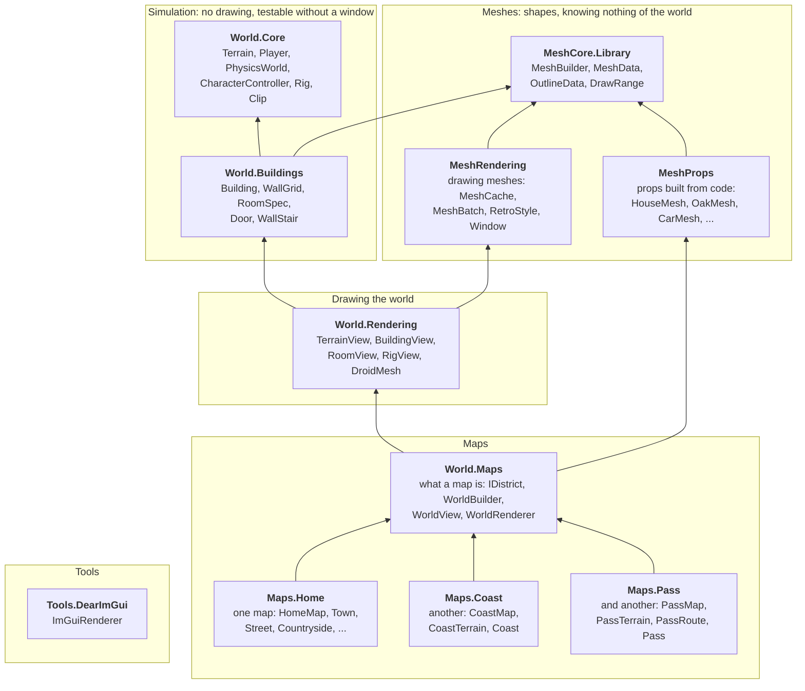
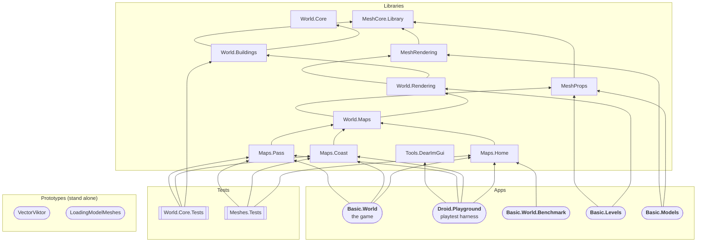

# Project map: how the libraries relate

An arrow means "references": `A --> B` means A may use B's public types. Arrows point towards what's more general (see [lesson 01](01-sharing-the-world.md)), so the most general libraries are at the bottom.

Only **direct** arrows that aren't already implied by another path are drawn. For example, [World.Maps](../World.Maps/World.Maps.csproj) also references World.Core in its `.csproj`, but it would get there anyway through World.Rendering and World.Buildings, so that arrow is left out to keep the picture readable.

## The libraries

Things to notice:

- There are **two roots**, World.Core and MeshCore.Library, and neither knows about the other. The simulation has no idea what anything looks like, and meshes have no idea what they're for.
- **World.Buildings is where they first meet.** A [RoomSpec](../World.Buildings/RoomSpec.cs) uses MeshCore so a room can say what it's made of, but it still draws nothing.
- **World.Rendering** is the first place the world is *drawn*: it joins the simulation (through World.Buildings) to MeshRendering.
- **Maps.Home, Maps.Coast and Maps.Pass sit side by side**, each depending only on the machinery below, never on each other. A map brings its own terrain (see [Map](../World.Maps/Map.cs)): the home map's is [TerrainGenerator](../World.Core/Terrain/TerrainGenerator.cs), the coast's is [CoastTerrain](../Maps.Coast/CoastTerrain.cs), the pass's is [PassTerrain](../Maps.Pass/PassTerrain.cs).
- **Tools.DearImGui** stands alone. It only needs MonoGame and Dear ImGui, so any app can pick it up.
- Every library also references the MonoGame package (for types like `Vector3` and `GraphicsDevice`); that isn't drawn.

## The apps and tests on top

The same picture with the executables and test projects added. The libraries are collapsed to keep it small.

- The game, the playground and the benchmark all reach the world the same way: through a map library (**Maps.Home**, and for the game and the playground **Maps.Coast** and **Maps.Pass** too), which pulls in everything below it. The game and the playground pick a map by name on the command line (`coast`, `pass`), home if none.
- **Basic.Levels** and **Basic.Models** are older apps that use the lower libraries directly, without the map machinery.
- **VectorViktor** and **LoadingModelMeshes** reference none of the solution's libraries; they're early prototypes (VectorViktor uses SharpGLTF to load models).
